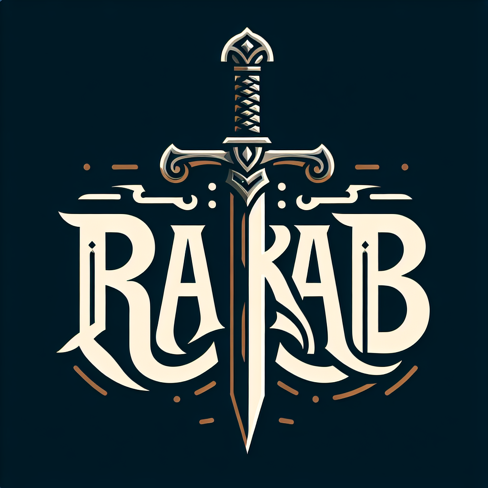

**This is Rakab**

A card game based on Condottire boardgame.

*NOTE: We developed this game for our university project for Advanced Programming 2024-Spring course*

This game is developed with C++, and we've implemented the graphical user interface with the help of [raylib library](https://github.com/raysan5/raylib)

---

<br>

## ✨ Features

🔹 3 - 6 Players

🔹 Cross Platform

🔹 Save multiple games

## 📬 Dependencies

- C++17 compatible compiler
- CMake build system (minimum 3.26.1)
- [Raylib](https://github.com/raysan5/raylib)

## scenes of the game:

Main menu:


Game:


## 📦 How to Build

1. Clone the repository:

```bash
git clone --depth=1 https://github.com/Reza-namvaran/Rakab.git
```


2. Navigate to the project directory:
```bash
cd Rakab
```

3. Generate the build files using CMake:
```bash
cmake -S . -B build
```

NOTE: for windows users:
```bash
cmake -S . -B build -G "MinGW Makefiles"
```

4. Navigate to the build directory:
```bash
cd build
```

5. Build the project:
```bash
make
```

## 🏹 Usage

Run the compiled executable in build directory:
```bash
./bin/Rakab
```

## 👥 Contributing

Contributions are welcome! Please fork the repository and create a pull request with your proposed changes.

## 🛡️ License

This project is licensed under the MIT License - see the LICENSE file for details.
